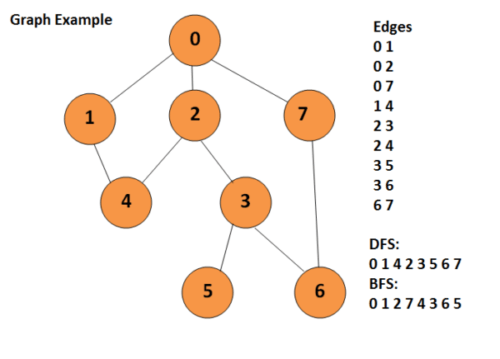

# Pygraph

This repo is more codegolfing with some basic graph theory, but with a primary focus on exploring the use of Python and its latest language features.

## Debugging / Running
---
You will need Python 3 in order to run this code. Presuming that the python executable in your PATH is pointed to a Python 3.x version, the following command will demonstrate the code:

`python main.py`

This image provides a visual of the example graph that this code is building and working with 

